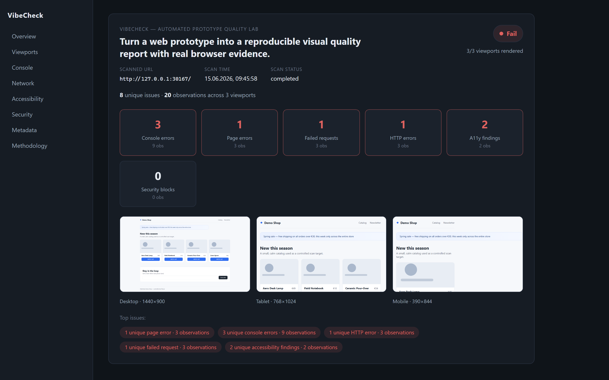

# VibeCheck — Automated Prototype Quality Lab

[](https://github.com/antoniussaid/vibecheck/actions/workflows/ci.yml)
[](LICENSE)

> Turn a web prototype into a reproducible visual quality report with real browser evidence.



_The report above is the snapshot committed in this repository. Every number in
it came from a real Chromium session — reproduce it with `npm run scan:demo`._

VibeCheck opens a **local** web prototype in real Chromium sessions across three
viewports and produces a structured, reproducible quality report: screenshots,
console events, failed network requests, HTTP errors and accessibility findings —
each backed by real, observed evidence.

> **Status: early, local-first build (v0).** An honest first milestone, not a
> hosted service. See [Scope](#scope).

## Live demo

A static **read-only** demo of the report viewer (with the committed example
report) is being prepared for Cloudflare Workers — it renders the curated
snapshot with no backend and no scanner. The public URL will be added here once
it is live; until then it is **not yet deployed**. The scanner itself always runs
locally and only against loopback targets. See
[`docs/DEPLOYMENT.md`](docs/DEPLOYMENT.md).

## Why this is not a ChatGPT prompt

A chat assistant can _guess_ what might be broken. VibeCheck **renders the real
page** and reports only what actually happened: the exact console error, the HTTP
404, the missing form label found by axe-core, and pixel screenshots at
1440×900, 768×1024 and 390×844. The artifacts (`report.json` + PNGs) exist only
because a real browser produced them.

## What it captures

- Desktop / tablet / mobile full-page **screenshots**
- **Console messages** and uncaught **page errors**
- **Failed network requests** and **HTTP errors** (status ≥ 400)
- **Accessibility findings** via axe-core
- **Security/policy findings** when the page tries to leave the loopback boundary
- A deterministic **summary** with Pass / Needs attention / Fail, separating
  **unique issues** from raw **observations** across viewports
- A versioned, schema-validated **`report.json`**

## Loopback-only egress boundary

The scanner enforces a real, technical boundary — not just a check on the URL you
type. Before navigation it installs request interception, blocks service workers,
aborts any request or WebSocket to a non-loopback host, and re-validates the
final URL after redirects. Allowed hosts are `localhost`, `127.0.0.1`, `::1`
(any port). Anything else is **blocked before egress** and recorded as a security
finding. See [`docs/SECURITY_BOUNDARIES.md`](docs/SECURITY_BOUNDARIES.md).

## Quick start

```bash
# 1. Install dependencies
npm install

# 2. Download Chromium into the project (node_modules)
npm run playwright:install

# 3. The repo already ships a curated demo report. Just open the viewer:
npm run dev:report
# then open the printed http://localhost:4174 URL

# (optional) refresh the curated snapshot from a fresh scan:
npm run update:demo-snapshot
```

### Scan an explicit local URL

```bash
# Start your own local prototype first (must be on localhost), then:
npm run scan -- --url http://localhost:5173
```

Only loopback hosts are accepted. Reports are always written under
`reports/<runId>/`; the CLI deliberately exposes no free output path.

## Repository layout

```
vibecheck/
├── apps/
│   ├── demo-fixture/      # "VibeCheck Demo Shop" — a deliberately flawed scan target
│   └── report-viewer/     # React SPA that renders (and runtime-validates) a report.json
│       └── public/report/ # committed curated demo snapshot
├── packages/
│   ├── scanner/           # Playwright + axe-core scanner, egress policy, CLI, test fixtures
│   ├── report-schema/     # versioned zod schema + deterministic summary/grouping
│   └── shared/            # URL/egress safety, run-id and path helpers
├── reports/               # ephemeral generated reports (git-ignored)
├── docs/                  # product spec, architecture, methodology, decisions
└── scripts/               # reproducible demo scan + snapshot tooling
```

## Scripts

| Script                             | Purpose                                                             |
| ---------------------------------- | ------------------------------------------------------------------- |
| `npm run dev:fixture`              | Run the demo fixture (http://localhost:4173)                        |
| `npm run dev:report`               | Run the report viewer (http://localhost:4174)                       |
| `npm run scan -- --url <url>`      | Scan a local URL                                                    |
| `npm run scan:demo`                | Build + serve + scan the demo fixture; never touches the snapshot   |
| `npm run update:demo-snapshot`     | Refresh the committed curated snapshot in the viewer                |
| `npm run verify:demo-snapshot`     | Validate the committed snapshot                                     |
| `npm run update:viewer-screenshot` | Re-shoot the README image from the committed snapshot               |
| `npm test`                         | Run all unit + integration tests (portable, project-local Chromium) |
| `npm run lint` / `format:check`    | ESLint / Prettier                                                   |
| `npm run build`                    | Type-check packages and build the apps                              |

## Scope

This first version is intentionally small and local. **Roadmap, not yet
implemented:** hosted/remote scanning, arbitrary external URLs, visual
regression, Lighthouse, PDF export, scan history, a GitHub App/Action,
per-viewport accessibility, and AI summaries. This build does **not** claim
support for arbitrary remote URLs, AI-generated summaries, a scanning GitHub
Action, or a production-ready SaaS. (The workflow in `.github/` only runs this
repository's own quality gates.)

## License

[MIT](LICENSE) © 2026 ANTONIUS
